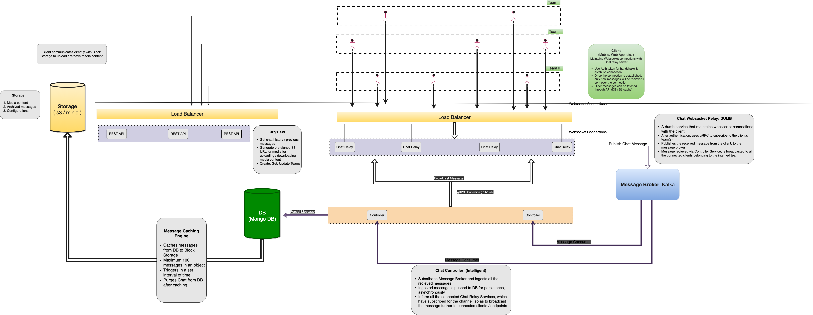

# Blakc-Architecture

# Overview

# Features
The end product is expected to ship with following features

### Authentication
- [x] Sign Up
- [x] Login

### Team Management
- [x] Create Team
- [x] Delete Team
- [x] Modify Team Details
- [x] Add Team Member
- [x] Remove Team Member
- [x] Add admin
- [x] Remove admin
- [x] Change team owner (Transfer ownership)
- [x] Deactivate Team (Disable messaging)

### Realtime Instant Messaging
- [x] Send text message in team channel (GM: Group Message)
- [x] Send media content in team channel (GM: Group Message)
- [x] Send text-message directly to a team member (DM: Direct Message)
- [x] Send media-content directly to a team member (DM: Direct Message)
- [x] Retrieve Chat history from team' channel
- [x] Retrieve Chat history from DM
- [x] Send voice message (explicit audio based media-content)
- [x] Search functionality for Chat messages

# Technology Stack
* Database: MongoDB
* Message Broker: Kafka
* Cache: Redis
* Storage: minio
* Programming Languages: NodeJS & GoLang (Backend's µServices)
* Webapp: Angular / React (Depends on developer's comfort level)

### Note:
#### The techstack was finalized, keeping in mind to not to have any explicit dependency on a particular cloud / infrastructure vendor, so as to make deployment / migration hassle free in near future.   

 

# Architecture

#### **Blakc** follows layered microservices architecture. This not only makes it easier to develop resillient & scalable app, but will also allow individual controbutors to develop delegated task parallely, reducing time to ship and faster development.
### Each individual layer can be easily scaled horizontally, making it easy to avoid any bottleneck.
 

# Components
Each component may have one or more microservices. Each microservice will have pre-determined controlled & only therequired access to other resources (DB, S3, peer services, etc.)

### Below is the list of major components:
* Authentication Service
* Messaging Service
* Management Service
* Storage Service
* Web App

### Note
#### Each component's individual achitecture & functionality is described in detail, in the later section. 
 

# Development lifecycle

* Bootstrap (No release)
* MVP (No release)
* Version 1
* Version 2
* Version 3
* Version 4
* Version 5 (Stable Build)

## Phase I: Bootstraping
### Tasks:
* Settigng up code-repositories
* Setting up the development environment
* Preparing dev. infrastructure (DB, minio, Kafka, etc.)
* Project Structuring

### Outcome: 
* Setting up of basic infrastructure with isolated Dev, QC, &  Production env.
* Getting familiar with tech., libraries & frameworks that coucould be new to developer.

### Estimated Time: 3 - 4 days

## Phase 2: MVP
### Tasks:
* Create a test project with a quic POC for each microservice & webapp, having working functionality for atleast:
    * Frontend to dummy API services 
    * Microservices to DB, S3, Kafka, etc.
    * Getting used to with the tech. stack

### Estimated Time: 2 days
 

## Version 1: App with basic functionality 

### Tasks:
* Develop `Authentication µService` with all the features 
* `Team Management µService` with basic functionality. 
* `Realtime IM Service`:
    * Chat Relay µService: Basic Websocket server accepting & successfully communicating with client web-app  
* `Web App`: Basic wireframed UI, along with HTTP & Websocket services, successfully conneting & communicating with each other. 

### Released Features:
### Authentication
- [x] Sign Up
- [x] Login

### Team Management
- [x] Create Team
- [x] Delete Team
- [x] Modify Team Details
- [ ] Add Team Member
- [ ] Remove Team Member
- [ ] Add admin
- [ ] Remove admin
- [ ] Change team owner (Transfer ownership)
- [ ] Deactivate Team (Disable messaging)

### Realtime Instant Messaging
- [ ] Send text message in team channel (GM: Group Message)
- [ ] Send media content in team channel (GM: Group Message)
- [ ] Send text-message directly to a team member (DM: Direct Message)
- [ ] Send media-content directly to a team member (DM: Direct Message)
- [ ] Retrieve Chat history from team' channel
- [ ] Retrieve Chat history from DM
- [ ] Send voice message (explicit audio based media-content)
- [ ] Search functionality for Chat messages

### Estimated Time: 7 days

### Release: Version 0.1 will be released with above features, for QA.

## Version 2: Enhanced features & bug fixes

### Tasks:
* `Team Management µService` with remaining functionality. 
* `Realtime IM Service`:
    * Successfully send & recieve messages over websockets
* `Web App`: 
    * UI Enhancement with new Screens, 
    * Chat messaging, Team management API & UI Integration

### Released Features:
### Authentication
- [x] Sign Up
- [x] Login

### Team Management
- [x] Create Team
- [x] Delete Team
- [x] Modify Team Details
- [x] Add Team Member
- [x] Remove Team Member
- [ ] Add admin
- [ ] Remove admin
- [ ] Change team owner (Transfer ownership)
- [ ] Deactivate Team (Disable messaging)

### Realtime Instant Messaging
- [x] Send text message in team channel (GM: Group Message)
- [ ] Send media content in team channel (GM: Group Message)
- [x] Send text-message directly to a team member (DM: Direct Message)
- [ ] Send media-content directly to a team member (DM: Direct Message)
- [ ] Retrieve Chat history from team' channel
- [ ] Retrieve Chat history from DM
- [ ] Send voice message (explicit audio based media-content)
- [ ] Search functionality for Chat messages

### Estimated Time: 7 days

### Release: Version 0.2 will be released with few enhanced features, & bug fixes for QA.

## Version 3: Enhanced features, performance improvement & bug fixes

### Tasks: 
* `Realtime IM Service`:
    * Integration with different message types
    * S3 / minio API integration for providing pre-signed URL
    * Implement & use Redis for frequently used data from MongoDB
    * REST API for retrieving older messages 
    * Admin management
* `Web App`: 
    * UI Enhancement with new Screen for new features
    * Chat: DM, & Group Messaging over websocket
    * Chat: Upload, download & preview media attachments

### Released Features:
### Authentication
- [x] Sign Up
- [x] Login

### Team Management
- [x] Create Team
- [x] Delete Team
- [x] Modify Team Details
- [x] Add Team Member
- [x] Remove Team Member
- [*] Add admin
- [*] Remove admin
- [*] Change team owner (Transfer ownership)
- [*] Deactivate Team (Disable messaging)

### Realtime Instant Messaging
- [x] Send text message in team channel (GM: Group Message)
- [*] Send media content in team channel (GM: Group Message)
- [x] Send text-message directly to a team member (DM: Direct Message)
- [*] Send media-content directly to a team member (DM: Direct Message)
- [*] Retrieve Chat history from team channel
- [*] Retrieve Chat history from DM
- [ ] Send voice message (explicit audio based media-content)
- [ ] Search functionality for Chat messages

### Estimated Time: 7 days

### Release: Version 0.3 will be released with few enhanced features, & bug fixes for QA.

## Version 4: Major change: Record & send voice messages with performance impr. & bug fixes

### Tasks: 
* `Realtime IM Service`:
    * Chat caching engine: Archive chat from MongoDB to s3 bucket
    * REST API: Retrieve chat from s3 & fallback to MongoDB
    * Purge duplicate chat history from DB
* `Web App`: 
    * Implement: record & send voice messages
    * Preview / Play recieved recorded messages
    * Integrate UI designs & screens

### Released Features:
### Authentication
- [x] Sign Up
- [x] Login

### Team Management
- [x] Create Team
- [x] Delete Team
- [x] Modify Team Details
- [x] Add Team Member
- [x] Remove Team Member
- [*] Add admin
- [*] Remove admin
- [*] Change team owner (Transfer ownership)
- [*] Deactivate Team (Disable messaging)

### Realtime Instant Messaging
- [x] Send text message in team channel (GM: Group Message)
- [*] Send media content in team channel (GM: Group Message)
- [x] Send text-message directly to a team member (DM: Direct Message)
- [*] Send media-content directly to a team member (DM: Direct Message)
- [*] Retrieve Chat history from team channel
- [*] Retrieve Chat history from DM
- [*] Send voice message (explicit audio based media-content)
- [*] Search functionality for Chat messages

### Estimated Time: 7 days

### Release: Version 0.4 will be released with few enhanced features, & bug fixes for QA.

## Version 5: Stable Build

### Tasks: 
* Sanity Checks
* Exception Handling
* Handling & dealing with edge cases 
    * Web socket: disconnectin
    * Web socket: retry mechanism
    * Improve UI
    * Bug Fixes
    * Performance improvement

### Released Features:
### Authentication
- [x] Sign Up
- [x] Login

### Team Management
- [x] Create Team
- [x] Delete Team
- [x] Modify Team Details
- [x] Add Team Member
- [x] Remove Team Member
- [*] Add admin
- [*] Remove admin
- [*] Change team owner (Transfer ownership)
- [*] Deactivate Team (Disable messaging)

### Realtime Instant Messaging
- [x] Send text message in team channel (GM: Group Message)
- [*] Send media content in team channel (GM: Group Message)
- [x] Send text-message directly to a team member (DM: Direct Message)
- [*] Send media-content directly to a team member (DM: Direct Message)
- [*] Retrieve Chat history from team channel
- [*] Retrieve Chat history from DM
- [*] Send voice message (explicit audio based media-content)
- [ ] Search functionality for Chat messages

### Estimated Time: 5 days

### Release: Stable & tagged release with all the required features 

#### Note:
Seach feature is left for the next phase. It will be integrated with MongoDB backed by Elastic Search.

