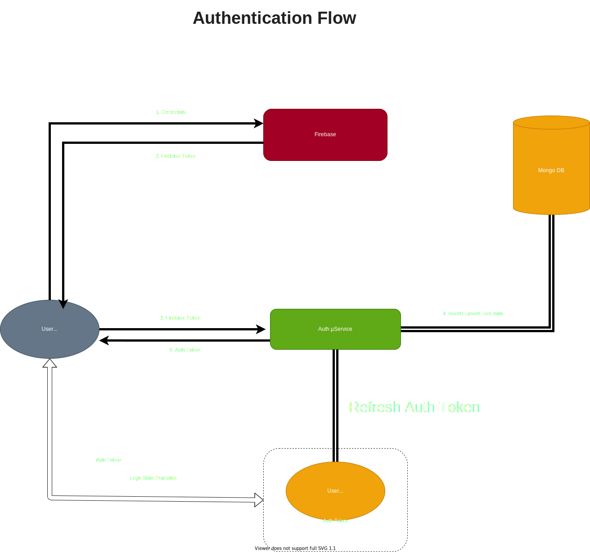

# Microservices (µServices)

## Each microservice should be independent, fault tolerant, and should be able to recover automatically in case of any failre.
## If a service has a dependency on any other service / DB/ Message Queue, it should be able to handle network connectivity issue, service downtime, etc. with a configurable retry mechanism, and inform the API reciever with appropriate error message.
 
 

* Authentication µService
* Team Management µService
* Realtime Messaging µService
* Payment Gateway µService
* Search Engine µService
* Configuration µService
* Filesstore µService

## Authentication *µService*:

### Purpose:
This will serve as a gatekeeper that's gonna be responsible for authenticating an user & issuing / refreshing short lived auth-tokens (JWT). This service will expose API and will only be communicating directly with the user vua frontend.
 
 
Authentication µService exposes a set of API endpoints that provides below functionalities: 
* Login
* SignUp
* Validate
* Refresh

### Authentication Flow:

### Features:

* Sign Up
    * via Email
    * via Google
    * via Facebook
    * via Github

* Sign In
    * via Email
    * via Google
    * via Facebook
    * via Github

* Account Recovery
    * via Password
    * via OTP

### Dependencies:
* *Firebase*: For sign-up & sign-in integration
* *DB*: For storing user related data in 

### Story:
*  Guest User:
    * Sign Up / Login: Client initiates a login/singup request from the fronetend, authenticates via Firebase and sends the recieved Firebase token to `Auth µService`. Auth Service validates the token, grabs primary key (email_id), and upsert (insert / update ) the details in MongoDB. 

    * Generate Auth Token: A short lived JWT token is generated for the user, and sent back to client. 
    The token contains a primary key (emailId) to identify unique user, along with basic details: 
        * Email (Primary Identifier)
        * Plan Details (Free-Tier, Premium, etc.)
        * Expiry Time (TTL)
        
*  Logged-in User: 
    * Token validation: Provision to validate token (valid/invalid) 
    * Refresh Token: Provision to refresh a valid token

### Implementation Details:
Programming language: Golang
Framework: FastHTTP for API
Versioning: Through URI (Eg: /{v1}/{route})

### Guidelines:
* Since, this service will be used extensively, performance & optimization should be considered from ground up while implementing functionality.
* All the parameters that vary for different env. (staging / productions) should be grabbed in via environment / config. file
* Every route must follow versioning pattern
* Authentication should be implemented as a middleware
* Logging mechanism 
* Use well defined JSON response structure  
* Honor HTTP Status Code (200, 403, 404, 500) 
* Proper error handling with logging, and custom error messages 

### Security Guidelines:
* Credentials should never be exposed in the logs
* No hardcoded tokens / credentials in the code
* No dynamic database query generation  
* Input sanitization  

