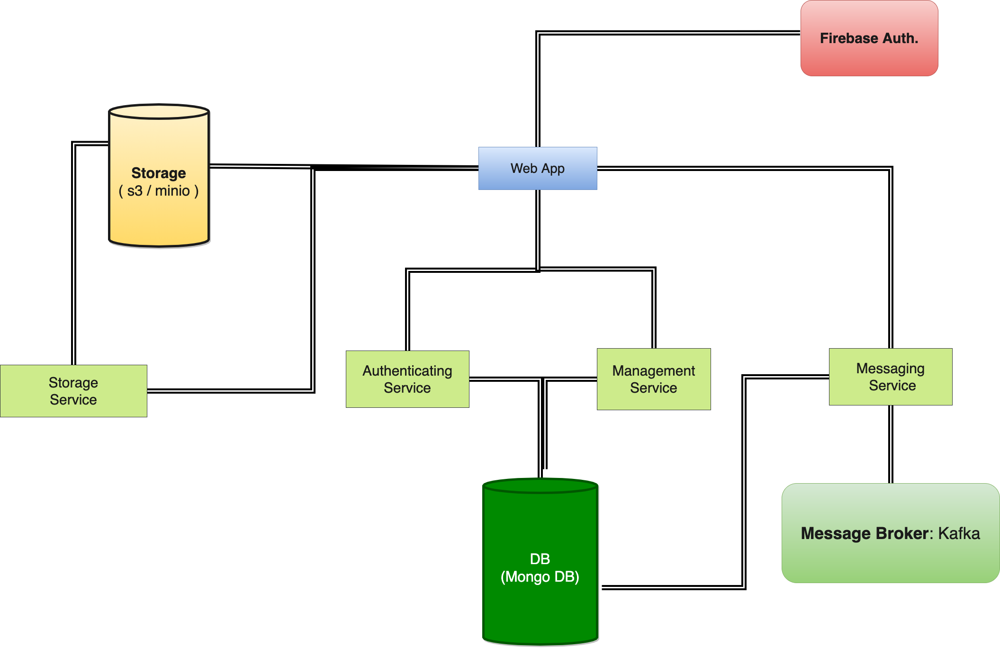

# Architecture

## Components

Each component may have one or more microservices. Each microservice will have pre-determined controlled & only the required access to other resources \(DB, S3, peer services, etc.\)

## Core components:

* Authentication Service
* Messaging Service
* Team Management Service
* Storage Service
* Web App \(Frontend App\)

> #### Note: 
>
> Each component's individual architecture & functionality is described in detail, in the later section.

## Component's Overview

_Bird's eye view of all the components, services and the connectivity between them_


Each component is explained in details in the subsection.



**Redis** will be used by almost all the microservices, and is not depicted explicitly in the architecture diagrams. Whenever cache is referred, it'd mean **Redis** and not in-memory cache, until stated explicitly.  **** 


