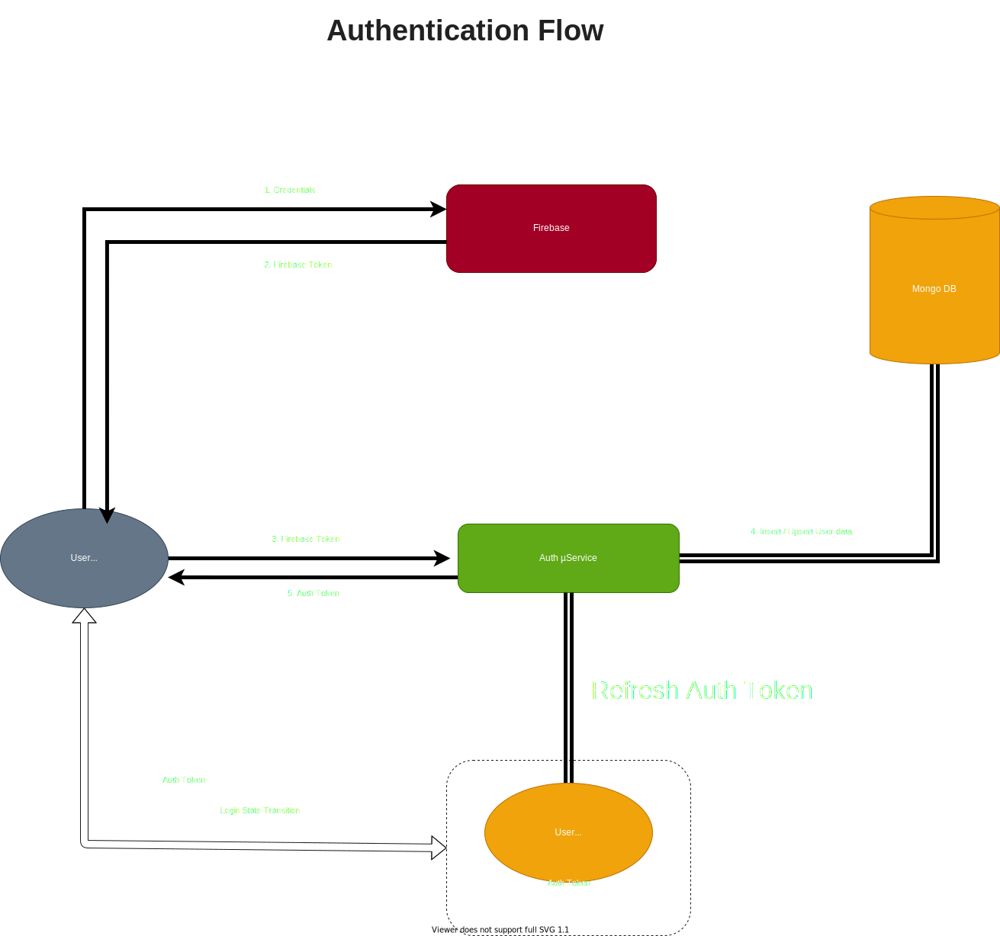

# Authentication Service

## Overview:

This will serve as a gatekeeper that's gonna be responsible for authenticating user & issuing / refreshing short lived auth-tokens \(JWT\). This service will expose API and will only be communicating directly with the user via frontend.   
   
 Authentication µService exposes a set of API endpoints that provides below functionalities:

* [x] Login
* [x] Sign Up
* [x] Validate Token
* [x] Refresh

## Storyboard

#### When a user fire up / refreshes blakc, `Authentication Service` is going to be the first point of contact, that would determine the his/her current state state. A user can be:  

* Guest User:
  * Sign Up / Login: Client initiates a login/sing-up request from the front-end, authenticates via Firebase and sends the received Firebase token to `Auth µService`. Auth Service validates the token, grabs primary key \(email\_id\), and upsert \(insert / update \) the details in MongoDB.
  * Generate Auth Token: A short lived JWT token is generated for the user, and sent back to client. The token contains a primary key \(emailId\) to identify unique user, along with basic details: 
    * Email \(Primary Identifier\)
    * Plan Details \(Free-Tier, Premium, etc.\)
    * Expiry Time \(TTL\)
* Logged-in User:
  * Token validation: Provision to validate token \(valid/invalid\) 
  * Refresh Token: Provision to refresh a valid token

## 

## Features:

* [x] Sign Up
  * via Email
  * via Google
  * via Facebook
  * via Github
* [x] Sign In
  * via Email
  * via Google
  * via Facebook
  * via Github
* [x] Account Recovery

  * via Password
  * via OTP

## Implementation Details:

* Programming language: **Golang**
* Framework: FastHTTP for API
* API Versioning: through URI \(Eg: /{v1}/{route}\)

## Dependencies

* _Firebase_: For sign-up & sign-in integration
* _DB_: For storing user related data in 

## Guidelines:

* Since, this service will be used extensively, performance & optimizations should be considered from ground up while implementing functionality.
* All the parameters that vary for different env. \(staging / productions\) should be grabbed in via environment / config. file
* Every route must follow versioning pattern
* Authentication should be implemented as a middleware
* Logging mechanism 
* Use well defined JSON response structure  
* Honor HTTP Status Code \(200, 403, 404, 500\) 
* Proper error handling with logging, and custom error messages 

## Security Guidelines:

* Credentials should never be exposed in the logs
* No hardcoded tokens / credentials in the code
* No dynamic database query generation  
* Input sanitisation  

