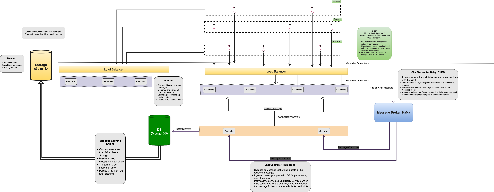

# Messaging Service

## Microservices:

* Relay Service **\(Websocket Server\)**
* Controller Service **\(gRPC Server\)**
* Management Service \(**REST API Server**\)
* Caching Engine \(**Headless Service**\)

## Dependencies

* Block storage: **Minio / s3** 
* Message Broker \(**Kafka**\)
* Load Balancer \(**nginx**\)

## Chat Service Architecture

 


It is recommended to download and zoom-in the above diagram to explore each component & it's functionality in detail.


 

## Relay Service 

### Web socket Server

A dumb client facing microservice, that maintains web socket connections with the client. The service will simply push received message to the Kafka \(MQ\). It also maintains a pub-sub based GRPC connection with `Controller Service`, and broadcasts messages received via it.

> #### **Programming Language**
>
> **NodeJS** with microWebSockets \(**µWS**\)

### **Functionality** 

* Maintain healthy web-socket connection with the client
* As soon as a new client gets connected, gRPC Controller service is published with the user's channel\_id to dynamically subscribe to the channel \(if not already done\) 
* Push received message to Kafka \(Message broker\)
* Broadcast the message , whenever the Controller Service triggers, to the clients associated with that channel\_id  

### **Tasks**

* [x] A dumb service that maintains web-socket connections with the client
* [x] After authentication, uses gRPC to subscribe to the client's team\(s\)
* [x] Publishes the received message from the client, to the message broker
* [x] Message received via Controller Service, is broadcasted to all the connected clients belonging to the intended team  

## Controller Service 

### gRPC Server

gRPC Server will act as a pub-sub, where WebSocket server can subscribe for new channel\_ids \(when a new client with a new channel\_id connects\). Controller will only publish the messages that belong to the subscribed channel\_id, saving ingress data, I/O, and CPU.

> #### **Programming Language**
>
> **`Golang`** + **gRPC**\)

### **Functionality** 

* Subscribes to Message Broker and ingests all the received messages
* Ingested message are pushed to DB for persistence, **asynchronously**
* Inform all the connected **Chat Relay Services**, which'd subscribed for the channel id\(s\),  to broadcast the message further to all the associated clients 

### Tasks

1. [x] Persist messages in DB
2. [x] \*Push only required message to the subscribed WebSocket server for broadcast

## Management Service

**A REST API** Service, exposing chat messaging related functionality that are supposed to be **not real-time.**.

### Tasks

* [x] Retrieve older chat messages for requested channel\_id
* [x] Look-up archived data in S3, and later fallback to MongoDB

> #### **Programming Language**
>
> **`Developer's choice. (Suggested: NodeJS / Golang)`**

## Caching Engine

A headless microservice, that would be responsible to archive / cache Chat messages from MongoDB to S3 Bucket, and purge redundant data from the database .

### Tasks

* [x] Backup chat messages from MongoDB to S3 with pagination support \(serve content in chunks\)
* [x] Purge redundant data from MongoDB
* [x] Trigger after defined interval and on ad-hoc request

> #### **Programming Language**
>
> **`Developer's choice. (Suggested: NodeJS / Golang)`**

**\`\`**

## \*\*\*\*

