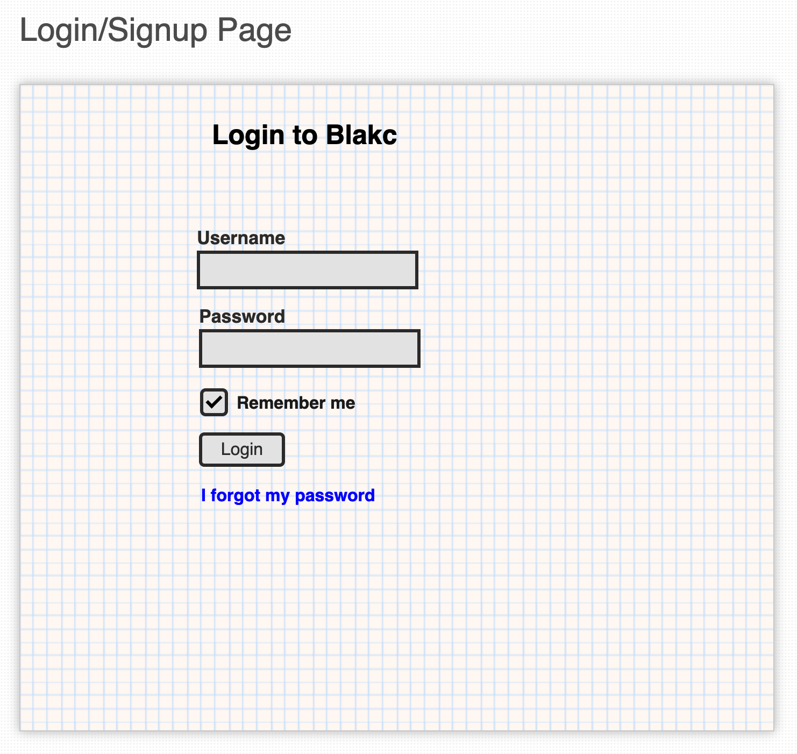
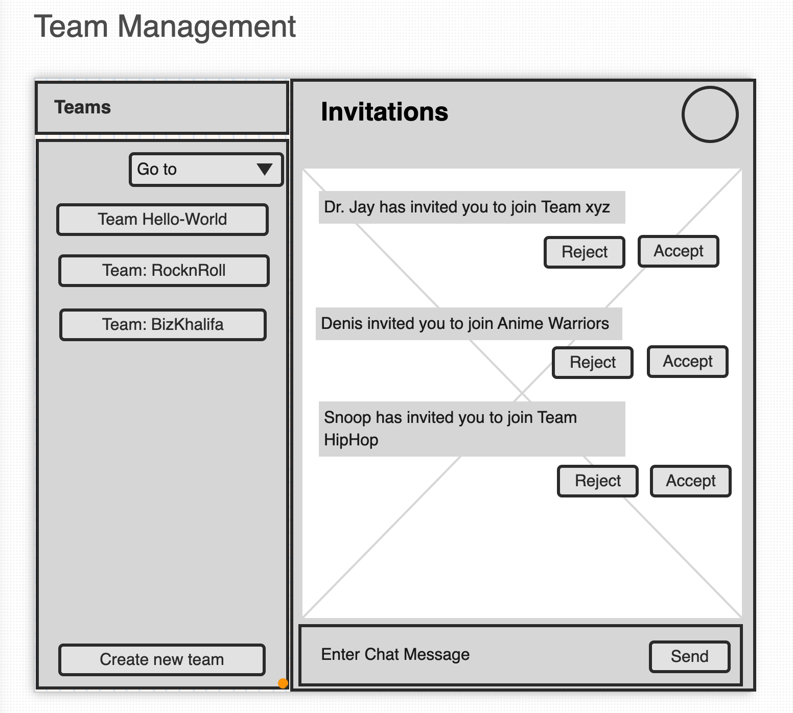
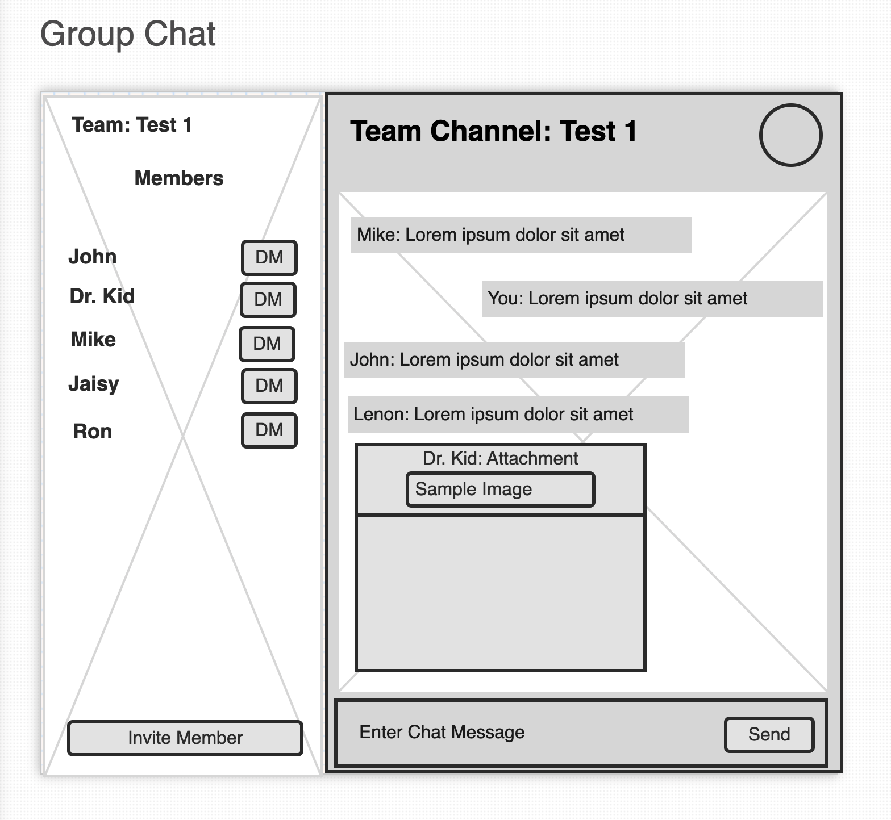
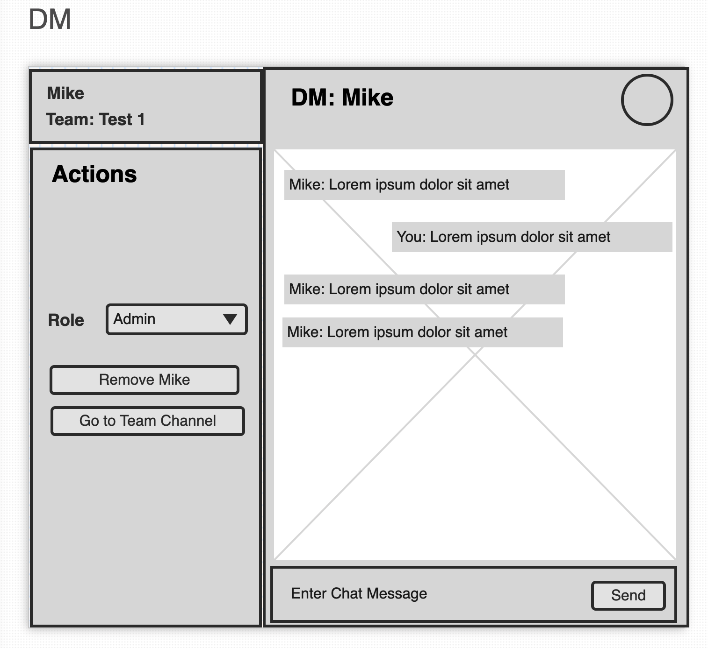

# Web App

## Tasks

* [x] Integration with microservices
* [x] Integration with Firebase
* [x] Integration with S3
* [x] Integration with Websocket Server
* [x] UI/UX  Integration

## Mock Screens

