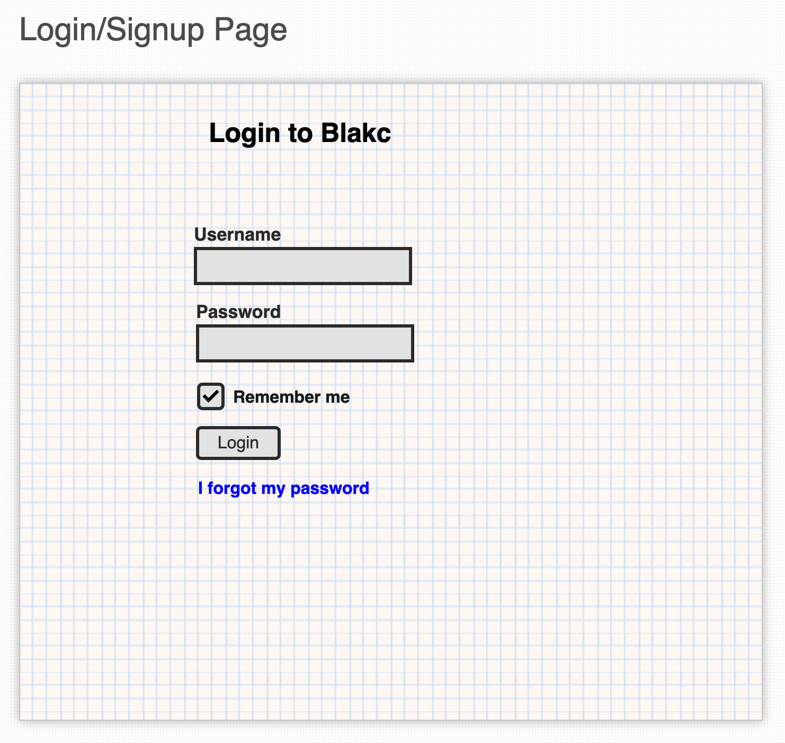
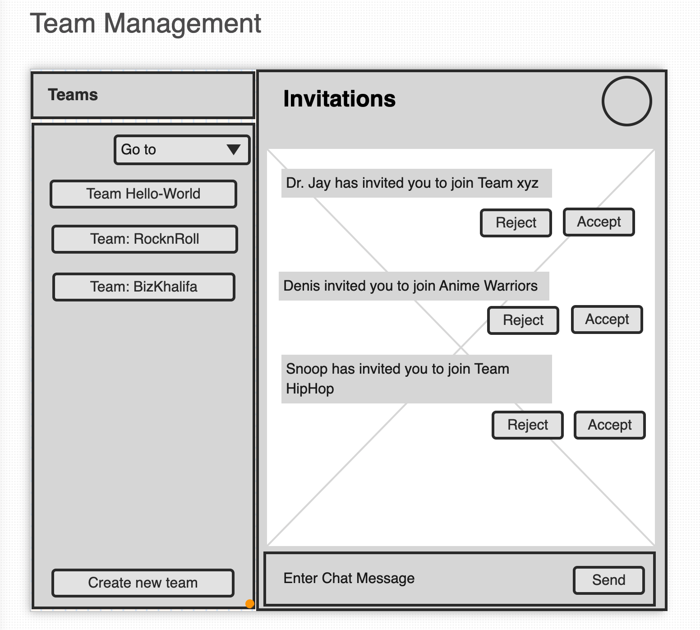
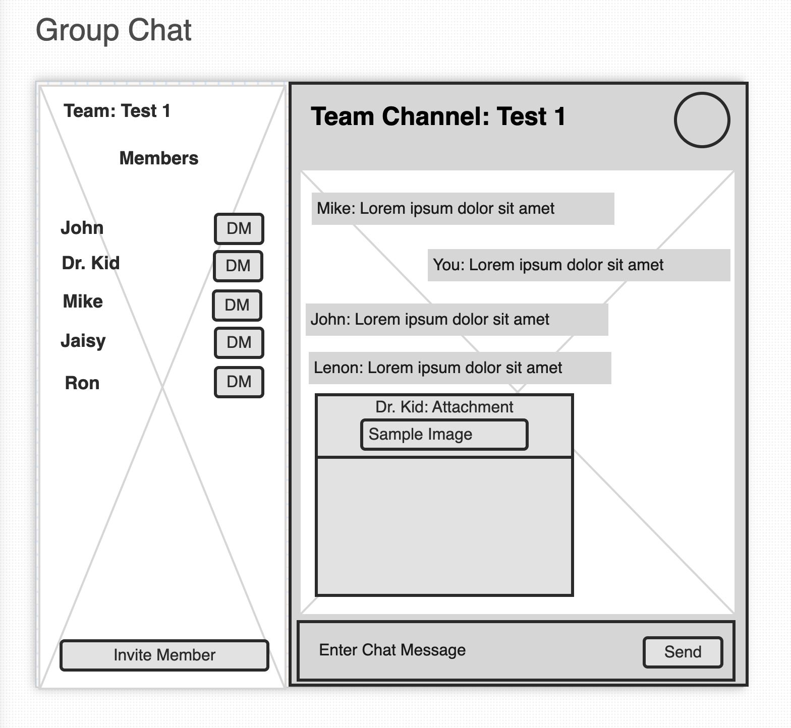
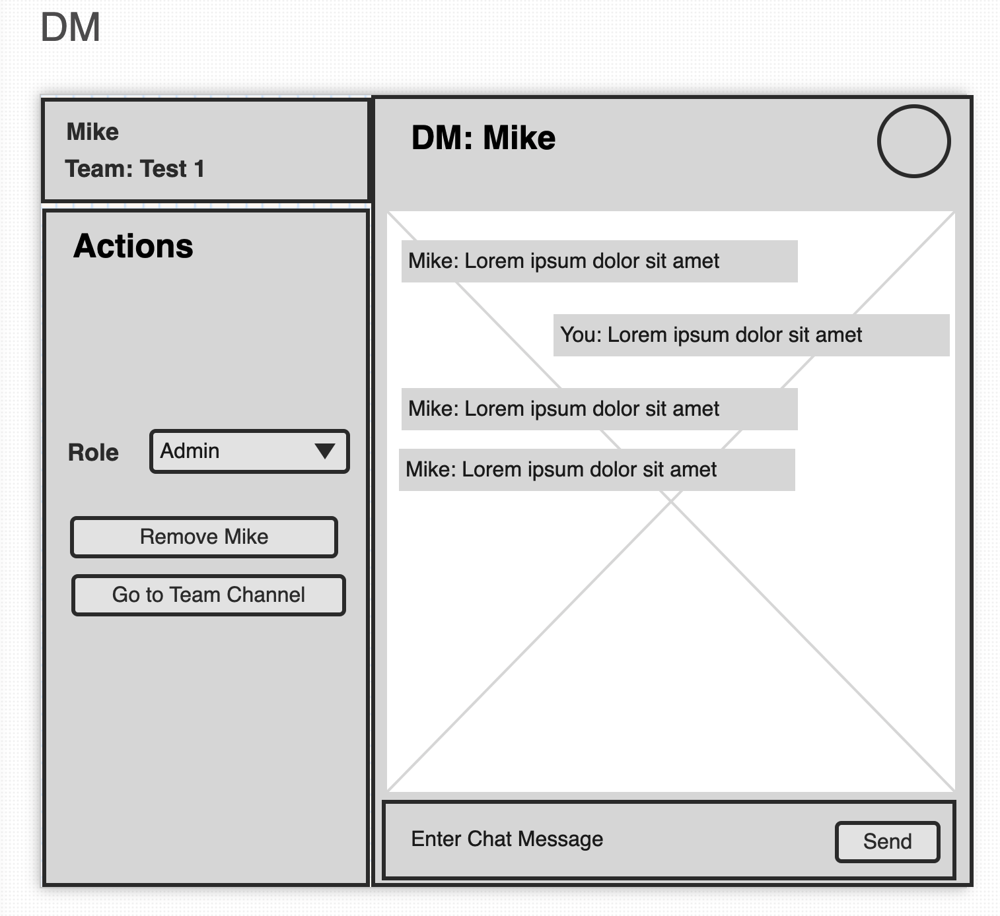

# Storyboard

## Login Page

User lands up at home page, and is redirected to Login page \(if not logged in already\)

SignUp & Login flow are one and the same thing. After authenticating via Firebase, custom Token is generated and new user is inserted / updated in the DB. 

## Team Management

After logging in, user lands at home page, where team can be managed. User is notified about the messages, team list, and request invitation received for joining the team.

* Create new Team
* Chat with team
* Respond to received invitations
* Navigate to other Screens

## Group Chat

When a user selects a team, he is redirected to group chat screen, where he gets a list of team members, messages being broadcasted in the channel, and action buttons \(if the user has admin privileged\) to invite / manage other users. Also, a member can DM to any member from the team.

## Direct Message

When a user clicks on DM button from the team's group chat page, he is able to send DM privately to the user.

